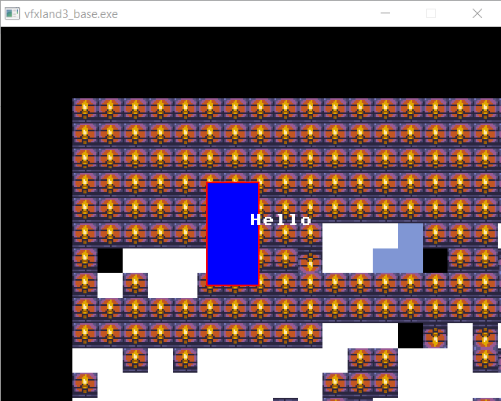
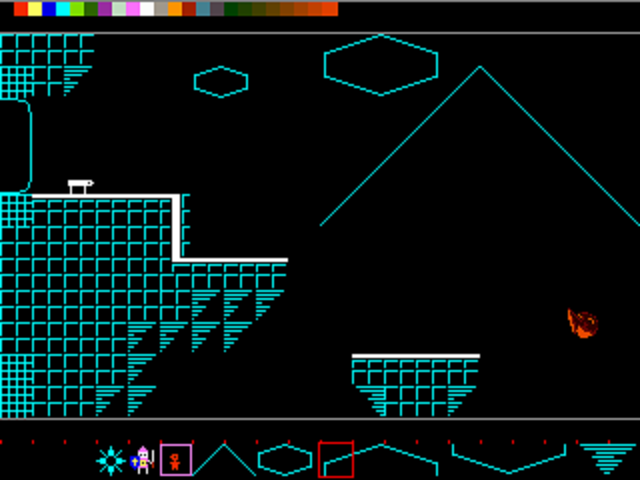
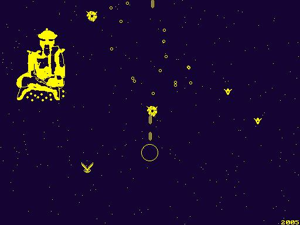

# roger’s december adventure

This page was initially published on 2023-12-11

Trying [this](https://eli.li/december-adventure) out. Do a little bit every day towards a programming project.

Apologies at not having a proper website yet. If for some crazy reason,  you'd want to reach me, I go by mcsleepy on Reddit.

I see myself as a simple artist who fell in love with programming. My interest in Forth in service of hobby game design has led me on some arduous but memorable journeys. I’ve released [a](https://store.steampowered.com/app/341060/The_Lady/) [few](https://inkajoo.itch.io/alright-were-gonna-walk-now) [games](https://inkajoo.itch.io/uncle-chunks-project-spin) and have a plethora of unfinished projects and gamedev-related bits of code tucked away in the dusty corners of my laptop. I decided to participate in decadv out of a desire to do better at showing my work, but also to get me to finish more stuff, which the former <i>should</i> help with. ;)

My trajectory is exploring game design, fueled by memories of my relationship with classic PC and console gaming growing up. As a starting place I will implement an [accelerated graphics window](https://liballeg.org/) (accelerated is necessary to be able to render tilemaps), a little library based on previous work, a REPL, and come up with a workflow and maybe some tools for just letting my creativity wander.

The main reasons I want to use Forth are: I don't want all the code I've already written to go to waste - including some semi-finished tools. Also, Forth, with the right mindset, is just plain fun.

Milestones should take the form of tools, small games or interactive demonstrations or artsy things. By the end of the month I want to be posting at least one interesting screenshot a day. 

I’m using [VFXForth](https://vfxforth.com/).

# 19-29

Updating the log again.

I made a Christmas card for a couple game designer friends, per a request.

It's on the Github, under the branch "xmas".  There's a snow effect comprising 20,000 snowflake objects, a dialogue box, and a kaiju snowman.

That was delivered on the 25th.  It triggered a false positive on Windows Defender.  Unfortunately I don't think there's anything I can do on my end. Thankfully, the fix for users is easy.

It's interesting to be able to take a snapshot of the stage by serializing it, which includes all 20,000 snowflakes.

On the 26th I fixed a couple minor bugs and cleaned things up.

I had an idea to use the serialization feature to create an animation system, kind of like Flash, so I can add some sledding sprites.

It's not strictly needed and I might just hardcode the animation for the sledders before the end of the year.

Over the past few days I've been thinking about how the animation system would actually work and I think I came up with a good scheme.

I also came up with a rough feature-list for the editor. It'll be cool to ressurect the old "Workspace" concepts. The main difference in this iteration is not caring about memory use, and the very permissive & minimalist approach to OOP.  I don't think it can actually be called OOP, it's more like pretend OOP.  POOP.

# 18

Worked on vfxland4 all day.  The shed has become a basic level editor.

- Lots of system bugfixes
- Serialization and Deserialization of any object and its children
- Snapping
- Delete

# 14-17

Wow, can't believe I hadn't posted since Wednesday. I thought I only took a day off!

I did at least a tiny bit every day... I think.

The project now has 5 main components.  The Allegro window (window.vfx), the game library (alpha.vfx), the display list (obj.vfx), the GUI (ui.vfx), and the dev environment (shed.vfx).  Of course there are addl supporting files but those are the main parts of the project itself.

The shed started very small but it contains all the stuff that's part of this iteration's workflow, so anything related to loading and testing code, interacting with the display list and extensions to the barebones GUI framework.

This morning I added the ability to drag objects around with the mouse.

# 13

- Minor fixes and improvements

I've been trying to find some inspiration.  I get flashes of what I'd like to do, but something holds me back.  The idea is something like a "VGA dream", complete with FM-synthesized music.  I won't do it unless there's something of more substance than just an "aesthetic".  I get these random visions, like pixel-tiles of everyday outdoor objects, and semi-abstract architecture with lots of gradients, set before a twilight/sunset backdrop.  Some kind of plain white structure surrounded by water.  Perhaps the tiles could be part of an "exhibit" within the structure, which could be like a "museum".

This will likely end up being a take on the "walking simulator" genre, which isn't a bad thing. I've been incubating these visions in the back of my mind for months...

I came up with a workflow idea, based around interactive testing and the display list (obj.f). I am going to try doing everything (except assets) with text files, with a mouse-based inspect/move tool and utility words to help out.

# 12

- Reorganized things related to the graphics window to make more sense
- Started to add an output overlay for the REPL then realized it was too much work for little immediate benefit
- Added matte border for the game viewport and ability to reposition it (for fullscreen)

# 11

- Moved the log to Github Pages after making some edits and bringing up to date.

# 10

- Cleanup.
- Added fixed-point literal support to the VFX interpreter, as doing without was just too inconvenient.
- Fleshed out more of the REPL.
- Re-implement frame delta time as I forgot how common different framerates are on computers now.
- Added "safety net". Whenever an object misbehaves, it is simply skipped, and error messages are continuously spewed to the VFX console.

# 9

- Bugfixes
- Added a circular matrix stack for nested transforms (overkill?)
- Ported vectored Forth output (lets us output numbers and things to a string which we then render).
- Beginnings of the REPL. Realtime stack display.

# 8

- Made this webpage and spent some time bringing it up to date.

Looking back over the work done so far has given me a sense of how much goes into game development, even when it’s minimalist. It is so easy to get lost in thinking about “necessary features”. It’s key to keep things *dead-*simple and do as much as possible with as little pre-work as possible, embracing all the limitations.

I need to think about stuff to make next. I may have gotten ahead of myself, as I don’t even know if I want to bother with tilemaps. But I might start with creating a level-editing tool. I or might use something readymade like [Tiled](https://www.mapeditor.org/) to just enjoy being creative and then put something into the engine.

Today I have to finish fixing a synth and put that and a few other pieces of gear up for sale since I got an Analog Rytm. (I also [make music](https://linktr.ee/topicalfruitsalad).) 

# 7

(Retrolog)

- Added text support. 4 lines, 8x8 stock Allegro font, nothing exciting. I had to do some errands.

# 6

(Retrolog)

- Found out about decadv. Probably added a few features and fixed some bugs.

# 5

(Retrolog)

- Finished laying some key groundwork.

- graphics window management
- keyboard & mouse (polling)
- basic graphics (rectangles, bitmaps)
- tilemaps w/ scrolling support
- fixed-point numbers (might backpedal on this)
- double-linked tree
- simplified file words
- game objects
- asynchronous timers

One tenet I want to follow is to not do anything in a vacuum. Engine and app components will be crafted with awareness of other ones. The rest go in lib\ and should only depend on other lib files (using VFX's REQUIRE).

# 4

(Retrolog)

- Made a [Github for vfxland4](https://github.com/rogerlevy/vfxland4) - should I keep everything in one repo? I’ll ask [a friend I met recently](https://rabbits.srht.site/decadv/) how they’ve handled this.

# 1 2 3

(Retrolog)

This was after around when I decided to revive my Forth work, going back to an old lineage where I treated Forth itself as the creative medium, not worrying about reuse or scaleability. It had the name TestPad at one point. Everything was open and direct, and trying ideas within the REPL (as well as compiling and testing code) was inspirational and productive.

The run-time model was and will be to compile the game on-the-fly from source files (basically scripts, only they assemble to high-performance code before initiating execution), and I’m using that approach again here because it really avoids a lot of complexity.  With modern OOP-following libraries, you can’t just compile your data into your binary and use it on-demand, you have to do a lot of initializing, so I’m sidestepping the extra code needed to do that by doing it at compile time.

I started by cleaning up the most previous codebase, vfxland3, making it more like TestPad by removing unnecessary features and simplifying some words. Calling it vfxland4 for now.

Here are a couple screenshots from around that aforementioned period.

